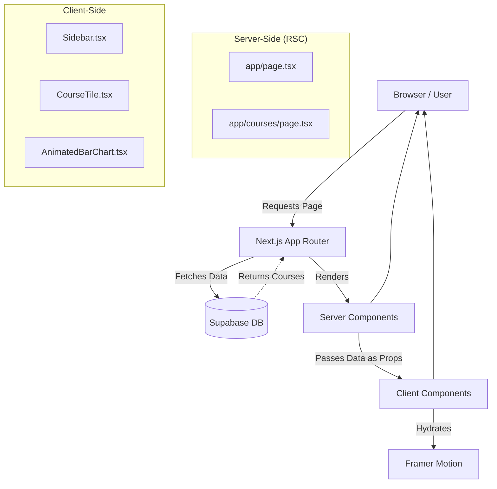
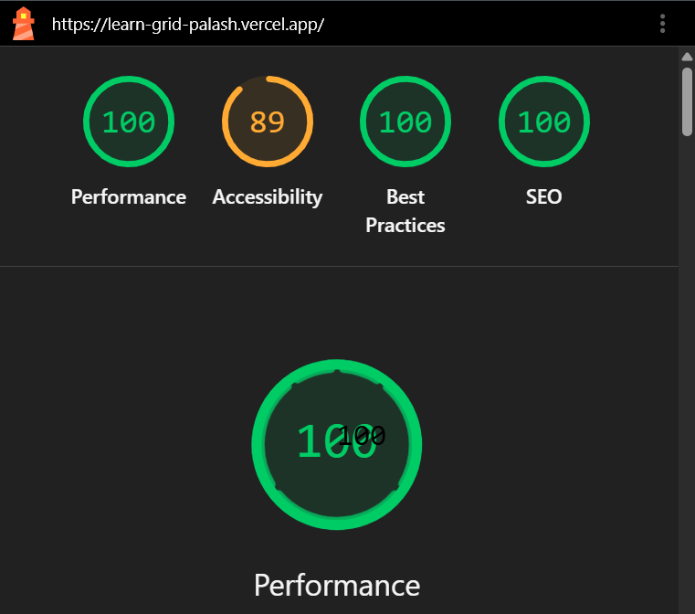

# LearnGrid - Next.js Student Dashboard

A modern, highly-interactive student dashboard built with Next.js App Router, Supabase, Tailwind CSS, and Framer Motion. 
Designed with a strict Dark-Mode Bento Grid aesthetic.

## Features

- **Bento Grid Layout**: Responsive grid that reflows automatically based on breakpoints (Desktop -> Tablet -> Mobile).
- **Framer Motion Animations**: 
  - Staggered page load animations for bento tiles.
  - Spring-physics hover effects on cards.
  - `layoutId` driven active background indicator on the sidebar navigation.
  - Animated progress bars inside course cards.
- **Server Components (RSC)**: Data is fetched server-side from Supabase, ensuring zero client-side fetching overhead and improved SEO/performance.
- **Dynamic Icons**: Course icons are rendered dynamically using Lucide React based on strings from the database.
- **Dark Mode Only**: Strict dark theme with glowing gradients and abstract grain textures.

## Architecture & Server/Client Split

This project follows Next.js 14/15 App Router best practices:

- **Server Components**: `app/page.tsx`, `app/layout.tsx`. These fetch data directly from Supabase. No `useEffect` or `useState` is used for data fetching.
- **Client Components**: 
  - `Sidebar.tsx`: Uses `usePathname` and `useState` for navigation logic and mobile toggling.
  - `BentoGrid.tsx`: Wraps the server-rendered tiles with Framer Motion `motion.div` elements. `framer-motion` requires `"use client"` since it relies on React Context and DOM APIs.
  - `CourseTile.tsx`: A Client Component because it utilizes `useState` and `useEffect` to trigger the progress bar animation after the initial mount, and uses `framer-motion` for spring hovers.

### Data Flow

1. `page.tsx` (Server Component) connects to Supabase using `@supabase/ssr`.
2. It fetches the `courses` list. If the connection fails (e.g., missing credentials), it gracefully falls back to mock data.
3. The server renders the Bento grid structure and passes the data down to the individual Tile components.
4. Client components like `CourseTile` hydrate and attach their interactive animations.

### Architecture Diagram



## Performance & Lighthouse Score

This application is built with a strict focus on performance, avoiding layout jank and minimizing client-side JS overhead.

- **Zero Layout Shifts (CLS: 0)**: All hover states and entrance animations use hardware-accelerated CSS transforms and opacity via Framer Motion.
- **Fast Contentful Paint**: Initial data fetching happens instantly on the server via Server Components.



## Getting Started

### Prerequisites

- Node.js (v18+)
- A Supabase Project

### Installation

1. Clone the repository:
   ```bash
   git clone <your-repo-url>
   cd LearnGrid
   ```

2. Install dependencies:
   ```bash
   npm install
   ```

3. Set up environment variables:
   Copy `.env.example` to `.env.local` and add your Supabase credentials:
   ```env
   NEXT_PUBLIC_SUPABASE_URL=your_supabase_url
   NEXT_PUBLIC_SUPABASE_ANON_KEY=your_supabase_anon_key
   ```

4. Set up the Database:
   Run the SQL queries provided in `supabase/schema.sql` in your Supabase SQL Editor to create the `courses` table and insert seed data.

5. Run the development server:
   ```bash
   npm run dev
   ```

## Deployment

Deploy easily to Vercel:

1. Push your code to a GitHub repository.
2. Import the project in Vercel.
3. Add your `NEXT_PUBLIC_SUPABASE_URL` and `NEXT_PUBLIC_SUPABASE_ANON_KEY` to the Vercel Environment Variables.
4. Deploy!

## Tech Stack

- **Framework**: Next.js (App Router)
- **Styling**: Tailwind CSS v4
- **Database**: Supabase
- **Animations**: Framer Motion
- **Icons**: Lucide React
- **Language**: TypeScript
